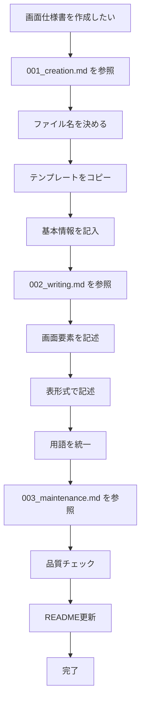

# 画面仕様書作成ルール概要

このドキュメントは画面仕様書の作成・編集に関するルールの概要を説明します。

## ドキュメント構成

画面仕様書のルールは以下の 4 つのファイルに分割されています：

### 1. **[新規作成](./001_creation.md)** - 新しい仕様書を作る時

- ファイル命名規則とディレクトリ構造
- テンプレートの使い方
- 新規作成の完全な手順

### 2. **[記述・更新](./002_writing.md)** - 仕様書を書く・編集する時

- 記述ルールと表形式での記述方法
- 用語統一と画面要素の記述
- 参照の書き方

### 3. **[管理・品質](./003_maintenance.md)** - 品質チェック・管理する時

- 品質チェック項目とレビュー基準
- README・インデックス管理
- 開発環境 URL・リンク管理

## 使い分けガイド

| やりたいこと                 | 参照するファイル                           |
| ---------------------------- | ------------------------------------------ |
| 新しい画面仕様書を作りたい   | [001_creation.md](./001_creation.md)       |
| 既存の仕様書を編集したい     | [002_writing.md](./002_writing.md)         |
| 表の書き方を知りたい         | [002_writing.md](./002_writing.md)         |
| 用語の統一ルールを確認したい | [002_writing.md](./002_writing.md)         |
| 品質チェックしたい           | [003_maintenance.md](./003_maintenance.md) |
| README を更新したい          | [003_maintenance.md](./003_maintenance.md) |
| 開発環境 URL を確認したい    | [003_maintenance.md](./003_maintenance.md) |

## 画面仕様書作成フロー

## 重要な原則

- **内容が存在しない場合でも表は作成し、`----` でブランク表示する**
- **権限名は用語集で定義された正式名称を使用する**
- **ソースコード上で確認できる仕様のみ記述する**
- **スタイル（CSS）に関する記述は含めない**

## 画面仕様書テンプレート

画面仕様書は [TEMPLATE.md](mdc:docs/screen-specs/TEMPLATE.md) のフォーマットを厳密に遵守してください。

## 困った時は

1. **まず概要（このファイル）で全体像を把握**
2. **やりたいことに応じて適切なファイルを選択**
3. **各ファイル内で具体的な方法を確認**

各ファイルは独立して完結するよう設計されているため、目的に応じて 1 つのファイルだけを参照すれば作業を完了できます。
