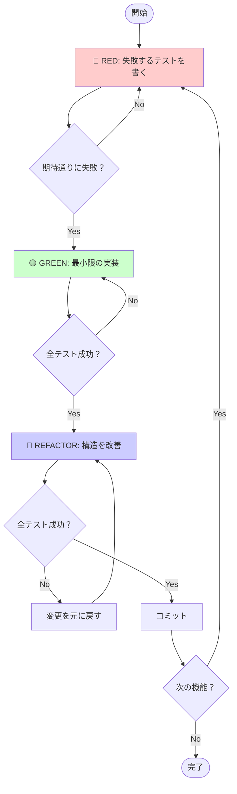
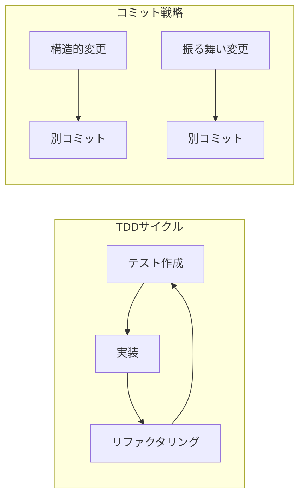
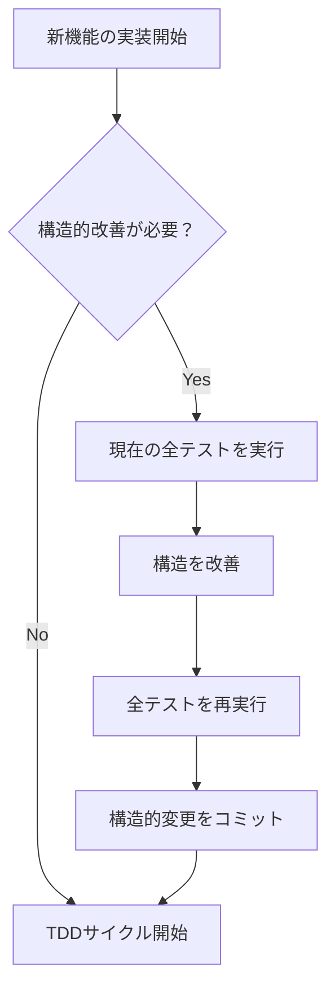

# TDDとTidy First開発ガイド

## 🎯 TDDの基本サイクル



## 📝 クイックリファレンス

### TDDの3ステップ
1. **🔴 RED** - 失敗するテストを先に書く
2. **🟢 GREEN** - テストを通す最小限のコードを書く
3. **🔵 REFACTOR** - コードを改善する（テストは常に通る状態を維持）

### Tidy Firstの原則
**構造的変更**と**振る舞い変更**を別々のコミットで管理する

## ✅ 実践チェックリスト

### RED Phase
- [ ] テスト名は振る舞いを説明している
- [ ] 1つのテストで1つの振る舞いのみ検証
- [ ] テストが期待通りに失敗することを確認

### GREEN Phase  
- [ ] テストを通す最小限のコードのみ実装
- [ ] すべての既存テストも通ることを確認
- [ ] 過度な一般化を避ける（YAGNI）

### REFACTOR Phase
- [ ] すべてのテストが通る状態から開始
- [ ] 小さな変更を段階的に実施
- [ ] 各変更後にテストを実行

## 🚀 実装フロー



## 💡 よくある問題と対策

| 問題 | 対策 |
|------|------|
| テストが大きすぎる | より小さな振る舞いに分解 |
| 実装が複雑 | シンプルな解決策から開始 |
| テストが遅い | 単体テストに集中、外部依存をモック化 |

## 📊 品質基準

- **テスト実行時間**: < 1秒/テスト
- **メソッドサイズ**: < 10行
- **テストカバレッジ**: 振る舞いベースで100%

## 🔧 実践例

```typescript
// 1️⃣ RED: 失敗するテストを書く
test('消費税を計算する', () => {
  expect(calculateTax(100)).toBe(110);
});

// 2️⃣ GREEN: 最小限の実装
function calculateTax(price: number) {
  return price * 1.1;
}

// 3️⃣ REFACTOR: 構造を改善
class TaxCalculator {
  private readonly TAX_RATE = 0.1;
  
  calculate(price: number): number {
    return price * (1 + this.TAX_RATE);
  }
}
```

## 📚 詳細情報

<details>
<summary>Tidy Firstアプローチの詳細</summary>

### 事前の構造的改善が必要な場合



### コミットメッセージの例
- 構造的変更: `refactor: UserValidatorクラスを抽出`
- 振る舞い変更: `feat: ユーザー認証機能を追加`
</details>


## 🎓 まとめ

TDDは**小さなステップ**で**安全に**コードを改善する手法です。
- テストが常に通る状態を維持
- 構造と振る舞いの変更を分離
- 継続的な改善サイクル

---

準備ができたら「go」で次の実装を開始します。