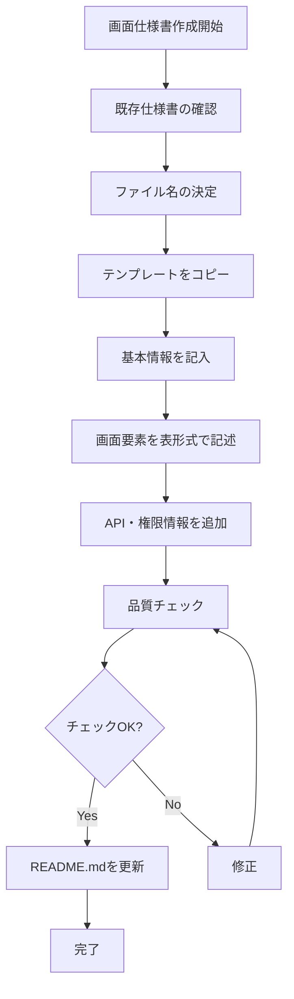

# Create Screen Spec Command

## Command
`create-screen-spec`

## Description
docs/rules/screen-specs/のルールに従って画面仕様書を作成します。

## Usage
このコマンドを実行すると、画面仕様書の作成プロセスを支援します。

## Prompt Template
```
画面仕様書を作成してください。

対象画面：[画面名を指定]
対象アプリ：[admin/customer/operation から選択]

以下のルールに従って作成してください：
- docs/rules/screen-specs/000_overview.md の全体構成を確認
- docs/rules/screen-specs/001_creation.md の命名規則に従う
- docs/rules/screen-specs/002_writing.md の記述ルールに従う
- docs/rules/screen-specs/003_maintenance.md の品質基準を満たす
- docs/screen-specs/TEMPLATE.md のテンプレートを使用
```

## 実行例

### 1. 既存画面の確認
```bash
# 関連する既存仕様書を検索
find docs/screen-specs -name "*.spec.md" | grep -i [画面名の一部]
```

### 2. ファイル名の決定
```
# 命名パターン
{アプリ}_{機能}_{画面・要素名}_{日本語名}.spec.md

# 例
- customer_mypage_mypage-page_顧客_マイページ.spec.md
- admin_customer-detail__affected-area-image-tab_管理者_顧客詳細__患部画像タブ.spec.md
```

### 3. テンプレートベースの作成
```bash
# テンプレートをコピーして新規作成
cp docs/screen-specs/TEMPLATE.md docs/screen-specs/[新しいファイル名].spec.md
```

### 4. 内容の記述
以下の要素を含めて記述：
- 画面の基本情報（目的、対象ユーザー、前提条件）
- URL情報
- 主要機能一覧
- 画面要素（表形式）
- APIエンドポイント
- 権限と表示制御
- エラーハンドリング
- 関連画面

### 5. 品質チェック
```bash
# 品質チェック項目の確認
- [ ] ファイル名が命名規則に従っている
- [ ] 権限名が正式名称を使用している
- [ ] 表が適切に作成されている（内容なしでも`----`表示）
- [ ] 参照リンクが正しく設定されている
- [ ] APIエンドポイントが明記されている
```

## 作成フロー


## 注意事項
- 画面仕様書は**ソースコードから確認できる仕様のみ**記述する
- スタイル（CSS）に関する記述は含めない
- 権限名は必ず用語集で定義された正式名称を使用
- 表は内容が存在しない場合でも作成し、`----`でブランク表示

## 関連コマンド
- `implementation` - 画面仕様書を基に実装を進める

## 参考資料
- [画面仕様書作成ルール概要](../../docs/rules/screen-specs/000_overview.md)
- [新規作成ガイド](../../docs/rules/screen-specs/001_creation.md)
- [記述・更新ガイド](../../docs/rules/screen-specs/002_writing.md)
- [管理・品質ガイド](../../docs/rules/screen-specs/003_maintenance.md)
- [テンプレート](../../docs/screen-specs/TEMPLATE.md)