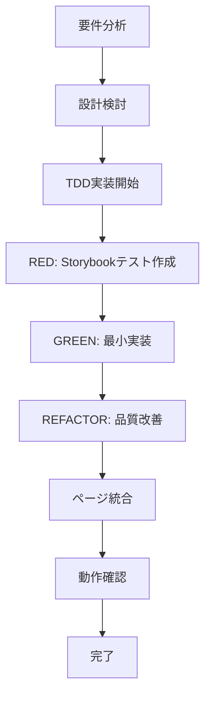
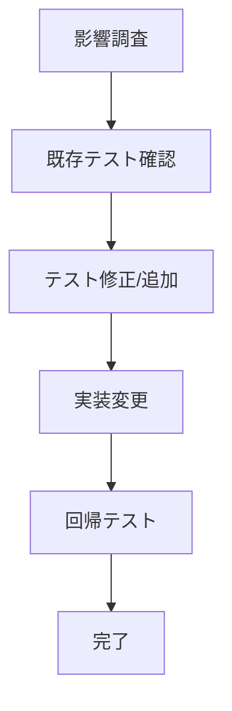
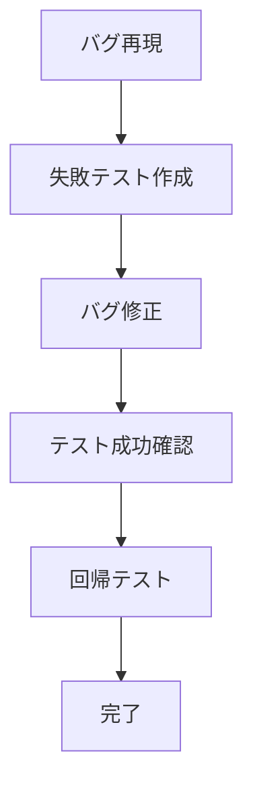
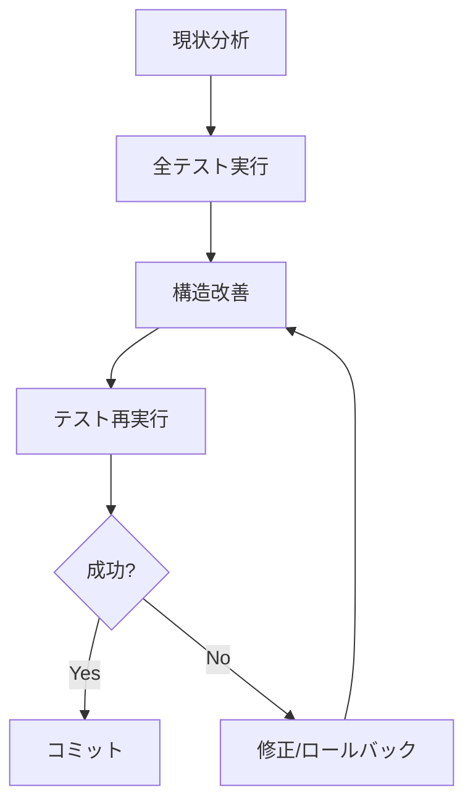
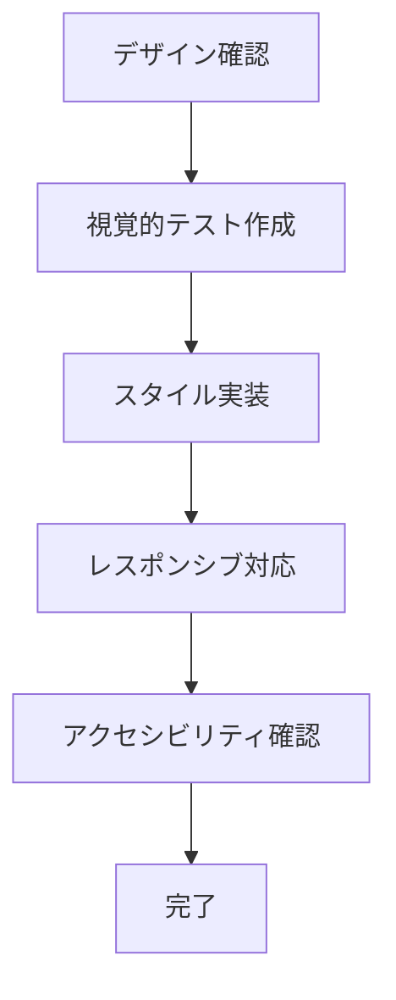

# 実装タスクワークフロー

このドキュメントは、Golfitterプロジェクトにおける各実装タスクの標準的な作業フローを定義します。

## 📋 実装タスクの種類

### 1. 新規機能開発
### 2. 既存機能の改修
### 3. バグ修正
### 4. リファクタリング
### 5. UI/UXの改善

---

## 🔄 標準実装フロー

### 事前準備フェーズ

1. **要件確認**
   - スクリーン仕様書の確認（`docs/screen-specs/`）
   - Figmaデザインの確認
   - 関連するドキュメントの確認

2. **実装計画**
   - TodoWriteツールで実装タスクを整理
   - 影響範囲の調査（Grep、Glob、Readツール使用）
   - 必要なコンポーネントの特定

### TDD実装フェーズ

#### 🔴 RED Phase - テストファースト

1. **Storybookファイルの作成**
   ```bash
   touch components/ComponentName/ComponentName.stories.tsx
   ```

2. **失敗するテストの実装**
   - play関数でユーザー視点のテストを記述
   - `docs/rules/frontend/011_tdd_with_storybook.md`のテンプレートを参照

3. **テストの失敗確認**
   ```bash
   npm run storybook
   ```

#### 🟢 GREEN Phase - 最小限の実装

1. **コンポーネントファイルの作成**
   ```bash
   touch components/ComponentName/ComponentName.tsx
   ```

2. **最小限のコード実装**
   - テストを通すための最小限のコードのみ
   - 型定義は`docs/rules/frontend/003_type_definitions.md`に準拠

3. **テストの成功確認**
   ```bash
   npm run test ComponentName.stories
   ```

#### 🔵 REFACTOR Phase - 品質改善

1. **コード品質の改善**
   - 命名規則の確認（`docs/rules/frontend/006_component.md`）
   - コンポーネント構造の最適化
   - 不変性の確保

2. **品質チェック**
   ```bash
   npm run lint
   npm run typecheck
   ```

### 統合フェーズ

1. **ページへの組み込み**
   - ディレクトリ構造（`docs/rules/frontend/002_architecture.md`）に準拠
   - page.tsx（サーバーコンポーネント）とPageName.tsx（クライアントコンポーネント）の役割分担

2. **ルーティング設定**
   - next/linkの使用
   - 動的ルートの型定義

3. **状態管理の実装**
   - 必要に応じてContextやカスタムフックの実装

### 品質保証フェーズ

1. **自動テスト**
   ```bash
   npm run test
   npm run lint
   npm run typecheck
   ```

2. **手動テスト**
   - 実際のブラウザでの動作確認
   - レスポンシブデザインの確認
   - アクセシビリティの確認

3. **コードレビュー準備**
   - コミットメッセージの整理
   - ドキュメントの更新（必要に応じて）

---

## 🛠️ タスク別詳細フロー

### 1. 新規機能開発



**具体的な手順:**

1. **要件分析**
   - スクリーン仕様書の作成/確認
   - APIインターフェースの確認
   - 既存コンポーネントの調査

2. **設計検討**
   - コンポーネント分割の検討
   - 再利用可能な部分の特定
   - 型定義の設計

3. **実装**
   - TDDサイクルに従って実装
   - `_components/`にページ固有コンポーネントを配置
   - `components/`に再利用可能コンポーネントを配置

### 2. 既存機能の改修



**具体的な手順:**

1. **影響調査**
   ```bash
   # 対象コンポーネントの使用箇所を調査
   grep -r "ComponentName" --include="*.tsx" --include="*.ts"
   ```

2. **既存テストの確認**
   - Storybookでの既存動作確認
   - play関数のテスト内容確認

3. **段階的な変更**
   - 構造的変更と振る舞い変更を分離（Tidy First）
   - 各変更後にテスト実行

### 3. バグ修正



**具体的な手順:**

1. **バグの再現**
   - 再現手順の確立
   - 影響範囲の特定

2. **テストファースト**
   - バグを再現する失敗テストを作成
   - Storybookのplay関数で再現

3. **修正実装**
   - 最小限の修正で対応
   - 副作用の確認

### 4. リファクタリング



**具体的な手順:**

1. **事前準備**
   - 現在の全テストが通ることを確認
   - リファクタリング対象の明確化

2. **段階的な改善**
   - 小さな変更を積み重ねる
   - 各変更後にテスト実行

3. **コミット戦略**
   - 構造的変更は独立したコミット
   - わかりやすいコミットメッセージ

### 5. UI/UXの改善



**具体的な手順:**

1. **デザイン実装**
   - Figmaからのコード生成（MCPツール使用）
   - スタイリングルール（`docs/rules/frontend/009_styling.md`）の適用

2. **インタラクション実装**
   - ユーザー操作のテスト作成
   - アニメーション/トランジションの実装

3. **品質確認**
   - 各デバイスサイズでの確認
   - キーボード操作の確認

---

## 📝 チェックリスト

### 実装前チェック
- [ ] 要件/仕様書を理解している
- [ ] 影響範囲を把握している
- [ ] 必要なツールを理解している

### 実装中チェック  
- [ ] TDDサイクルに従っている
- [ ] テストが期待通りに動作している
- [ ] 命名規則に従っている
- [ ] 型定義が適切である

### 実装後チェック
- [ ] 全テストが通っている
- [ ] Lintエラーがない
- [ ] 型エラーがない
- [ ] ドキュメントが更新されている（必要に応じて）

---

## 🔧 便利なコマンド集

### 開発時によく使うコマンド

```bash
# Storybook起動
npm run storybook

# テスト実行（特定ファイル）
npm run test ComponentName.stories

# 全テスト実行
npm run test

# 型チェック
npm run typecheck

# Lint実行
npm run lint

# Lint自動修正
npm run lint:fix

# 開発サーバー起動
npm run dev
```

### ファイル検索コマンド

```bash
# コンポーネントの使用箇所を検索
grep -r "ComponentName" --include="*.tsx" --include="*.ts"

# 特定のパターンを含むファイルを検索
find . -name "*.tsx" -type f | xargs grep "pattern"

# ファイル名で検索
find . -name "*Component*" -type f
```

---

## 📚 参考資料

- [TDDとTidy First開発ガイド](../docs/rules/tdd-guideline.md)
- [フロントエンド実装ルール](../docs/rules/frontend/000_init.md)
- [TDDとStorybookを活用したコンポーネント開発](../docs/rules/frontend/011_tdd_with_storybook.md)
- [スクリーン仕様書作成ガイド](../docs/rules/screen-specs/000_overview.md)