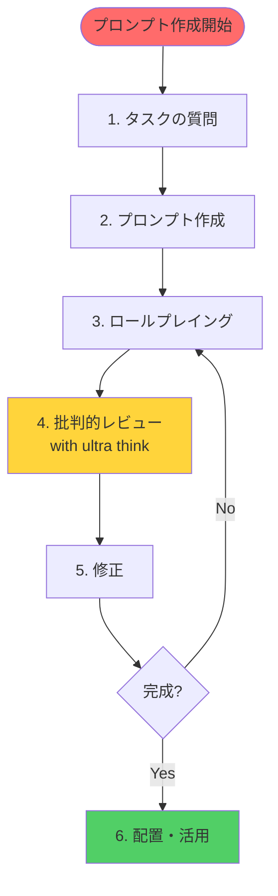
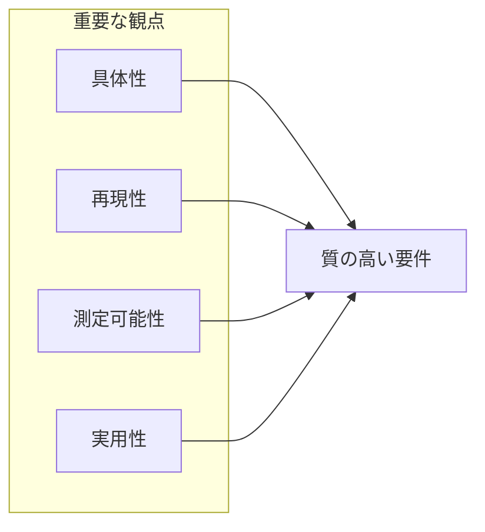
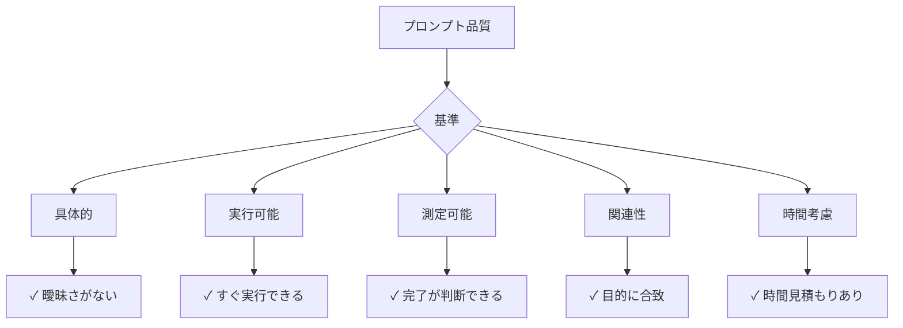
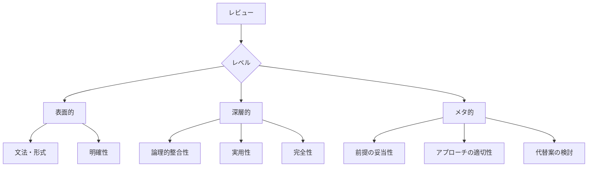
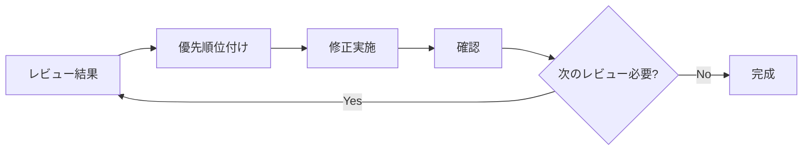
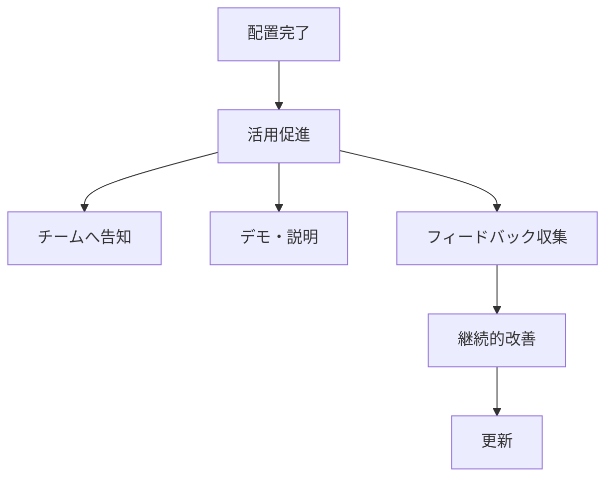

# プロンプト作成ワークフロー

## 概要
特定のタスクに対する専門的なプロンプト（ワークフロードキュメント）を作成するための体系的なプロセス。

## 適用シーン
- 新しい開発タスクのワークフローが必要
- 既存の問題に対する解決プロセスを標準化したい
- チーム共通の作業手順を定義したい

## プロンプト作成フロー



## Step 1: タスクの質問

### 1.1 質問テンプレート

```markdown
どのようなタスクのプロンプトを作成しますか？以下の情報を教えてください：

1. **タスク名**: 
   - 例: コンポーネント実装、バグ修正、リファクタリング

2. **発生状況**:
   - いつこのタスクが必要になるか
   - どんな問題を解決するか

3. **現在の課題**:
   - 何が難しいか
   - どんなミスが起きやすいか

4. **期待する成果**:
   - このプロンプトで何を達成したいか
   - 品質基準は何か

5. **対象者**:
   - 誰が使うか（初心者/中級/上級）
   - 前提知識は何か
```

### 1.2 情報収集のポイント



## Step 2: プロンプト作成

### 2.1 プロンプト構造テンプレート

```markdown
# [タスク名]ワークフロー

## 概要
[1-2文でタスクの目的と価値を説明]

## 適用基準
### このワークフローを使う場合
- [具体的な状況1]
- [具体的な状況2]

### 使わない場合
- [例外ケース1]
- [例外ケース2]

## 前提条件
- [必要な環境]
- [必要な知識]
- [必要なツール]

## ワークフロー

[mermaidフロー図]

## Phase 1: [フェーズ名] (推定時間)

### 1.1 [ステップ名]
[具体的な手順]

```bash
# 実行可能なコマンド例
```

### 1.2 [ステップ名]
[判断基準や確認事項]

## Phase 2: [フェーズ名] (推定時間)
[以下同様に続く]

## よくある問題と対策

| 問題 | 原因 | 対策 |
|------|------|------|
| [問題1] | [原因] | [具体的な対策] |

## チェックリスト
- [ ] [確認事項1]
- [ ] [確認事項2]

## コマンドリファレンス
```bash
# よく使うコマンド集
```

## 関連ドキュメント
- [関連リンク]
```

### 2.2 品質基準



## Step 3: ロールプレイング

### 3.1 ロール設定

```markdown
## ロール設定チェックリスト

1. **専門性の定義**
   - [ ] このタスクの専門家は誰か
   - [ ] どんな経験を持っているか
   - [ ] どんな視点で評価するか

2. **評価基準**
   - [ ] 技術的正確性
   - [ ] 実用性
   - [ ] 効率性
   - [ ] 保守性
   - [ ] 安全性

3. **批判的視点**
   - [ ] 見落としている前提条件
   - [ ] エッジケース
   - [ ] より良い代替案
   - [ ] 潜在的リスク
```

### 3.2 レビュー実行時の指示例

```markdown
あなたは[ロール名]です。以下のワークフローを、あなたの専門性と経験に基づいて批判的にレビューしてください。with ultra think

レビューの際は：
1. 表面的な問題だけでなく、根本的な設計の問題を指摘
2. このワークフローが実際に使われた場合の問題を予測
3. より良い代替案があれば提案
4. 見落とされている重要な観点を指摘
```

### 3.3 レビュー観点マトリクス

| ロール | 重視する観点 | チェックポイント |
|--------|------------|---------------|
| アーキテクト | 設計・構造 | 拡張性、保守性、パターン |
| セキュリティエンジニア | 安全性 | 脆弱性、認証、データ保護 |
| パフォーマンスエンジニア | 効率性 | 速度、リソース、スケール |
| QAエンジニア | 品質・テスト | カバレッジ、エッジケース |
| DevOpsエンジニア | 運用性 | 自動化、監視、デプロイ |

## Step 4: 批判的レビュー (with ultra think)

**重要**: このフェーズでは、設定したロールの専門性に完全に没入し、深い思考（ultra think）を用いて批判的にレビューを行います。表面的な指摘に留まらず、根本的な問題や見落とされがちな観点まで掘り下げてください。

### Ultra Thinkの活用方法
- **前提を疑う**: 当たり前とされている前提条件は本当に正しいか？
- **代替案を探る**: 現在のアプローチ以外により良い方法はないか？
- **連鎖的影響を考慮**: この実装が将来的にどんな問題を引き起こす可能性があるか？
- **エッジケースを想定**: 通常想定されない状況でどう動作するか？
- **専門家の直感**: その分野の専門家として「何か違和感がある」部分はないか？

### 4.1 レビューテンプレート

```markdown
## [ロール名]としてのレビュー (with ultra think)

### 強み
- [良い点1]
- [良い点2]

### 改善が必要な点

#### 1. [問題カテゴリ]
**問題**: [具体的な問題]
**影響**: [この問題による影響]
**提案**: [改善案]

#### 2. [問題カテゴリ]
[同様に記載]

### 見落とされている観点
- [観点1]: [説明]
- [観点2]: [説明]

### 優先度付き改善提案
1. **高優先度**: [すぐ修正すべき点]
2. **中優先度**: [改善が望ましい点]
3. **低優先度**: [将来的な改善点]
```

### 4.2 レビューの深さ



## Step 5: 修正

### 5.1 修正プロセス



### 5.2 修正チェックリスト

```markdown
## 修正時の確認事項

### 技術的修正
- [ ] 誤った情報の訂正
- [ ] 不足している手順の追加
- [ ] より良いアプローチへの変更

### 構造的修正
- [ ] フローの見直し
- [ ] セクションの再構成
- [ ] 優先順位の調整

### 表現的修正
- [ ] 曖昧な表現の明確化
- [ ] 専門用語の説明追加
- [ ] 例の追加・改善

### 実用的修正
- [ ] 実行可能なコマンドの追加
- [ ] エラー処理の追加
- [ ] トラブルシューティングの充実
```

## Step 6: 配置・活用

### 6.1 ファイル配置

```bash
# タスクワークフローは docs/tasks/ 配下に配置
docs/tasks/[タスク名]-workflow.md

# 例:
# docs/tasks/test-fix-workflow.md
# docs/tasks/implementation.md
# docs/tasks/prompt-creation-workflow.md

# Claude/Cursor同期
npm run sync:claude-cursor

# Git管理
git add docs/tasks/[タスク名]-workflow.md
git commit -m "docs: [タスク名]ワークフローを追加"
```

### 6.2 活用促進



## 実例: テスト修正ワークフローの作成過程

### 1. タスクの質問
「TDDサイクルから逸脱して大量のテストが失敗している時の対応方法」

### 2. 初版作成
基本的な修正フローを作成

### 3. DevOpsエンジニアとしてレビュー (with ultra think)

#### 問題点の指摘（深い思考による分析）
1. ロールバックの観点が不足
2. タイムボックスの設定なし
3. エスカレーション基準が曖昧

### 4. 修正

#### 改善内容
1. 緊急対応フローを最初に追加
2. 各フェーズに時間制限を設定
3. エスカレーション基準を明確化

## まとめ

### 成功のポイント

1. **具体的な質問** - 曖昧さを排除
2. **構造的な作成** - テンプレートの活用
3. **多角的なレビュー** - 専門家視点の導入
4. **反復的な改善** - レビューと修正のサイクル

### アンチパターン

1. ❌ 最初から完璧を目指す
2. ❌ 一つの視点だけでレビュー
3. ❌ 抽象的な内容に留まる
4. ❌ 実例やコマンドを省略

## 関連ドキュメント

- `/docs/rules/tdd-guideline.md` - TDDガイドライン
- `/docs/tasks/` - タスクワークフロー一覧
- `/docs/tasks/implementation.md` - 実装ワークフロー
- `/docs/tasks/test-fix-workflow.md` - テスト修正ワークフロー