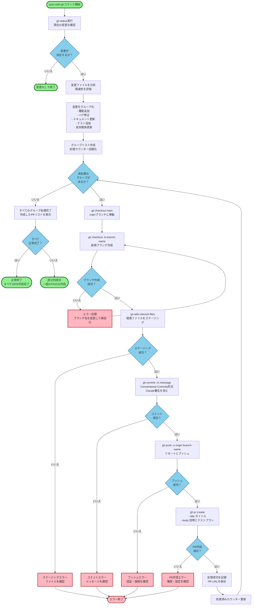

# sync-with-gh コマンドフロー図

AI agentが認識しやすいように構成されたsync-with-ghコマンドの作業フロー図です。

## AI Agent向け最適化のポイント

このmermaid図は、AI agentが認識しやすいように以下の工夫をしています：

### 1. 視覚的な区別
- **開始・終了点**: 緑色（`startEnd`クラス）で明確に区別
- **エラー処理**: 赤色（`error`クラス）で異常系を明示
- **判断ポイント**: 青色（`decision`クラス）の菱形で条件分岐を表現
- **処理ステップ**: 黄色（`process`クラス）で通常処理を表現

### 2. 明確な処理フロー
- 各ステップで実行する具体的なgitコマンドを記載
- 判断基準を明確に記述（「成功？」「存在するか？」）
- エラー時の処理パスを明示

### 3. ループ構造の可視化
- グループごとの処理がループになることを明確に表現
- カウンター更新による進行管理を明示

### 4. 状態管理
- 処理の進行状況が追跡可能
- 部分的成功と完全成功を区別

### 5. エラーハンドリング
- 各フェーズでのエラー処理を明示
- リトライ可能な箇所（ブランチ作成）を表現

この構成により、AI agentは：
- どの段階で何を実行すべきか明確に理解できる
- エラー時の対処方法が分かる
- 全体の処理フローを俯瞰的に把握できる