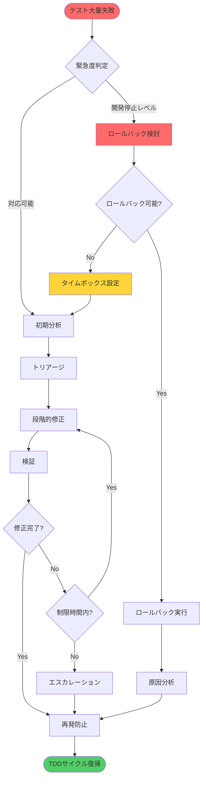
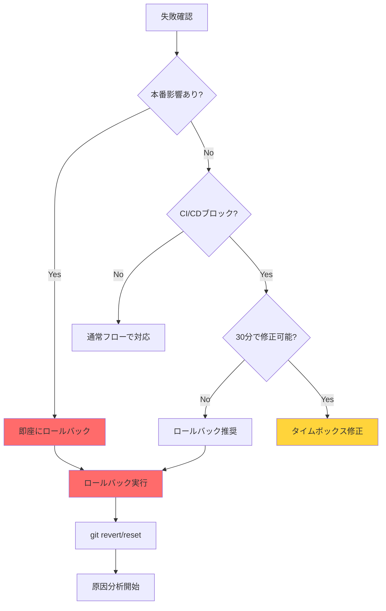
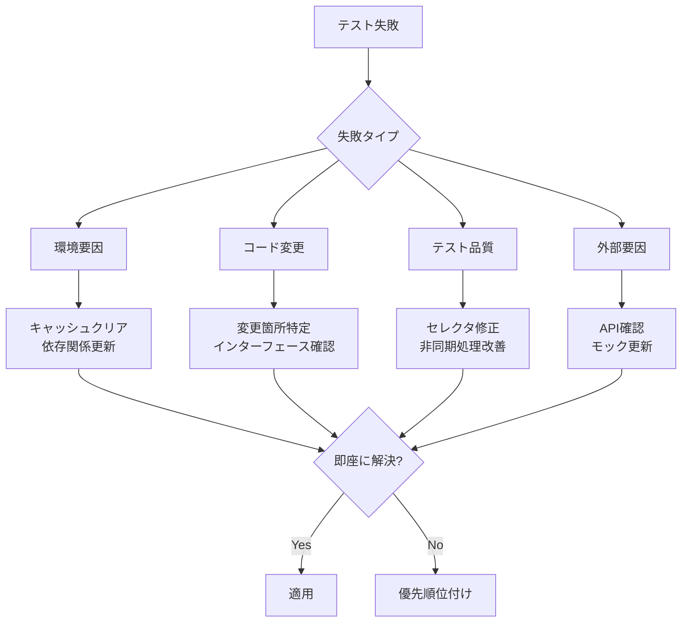
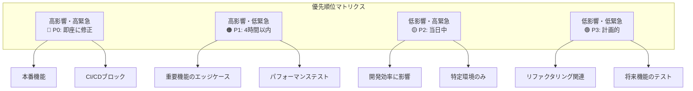
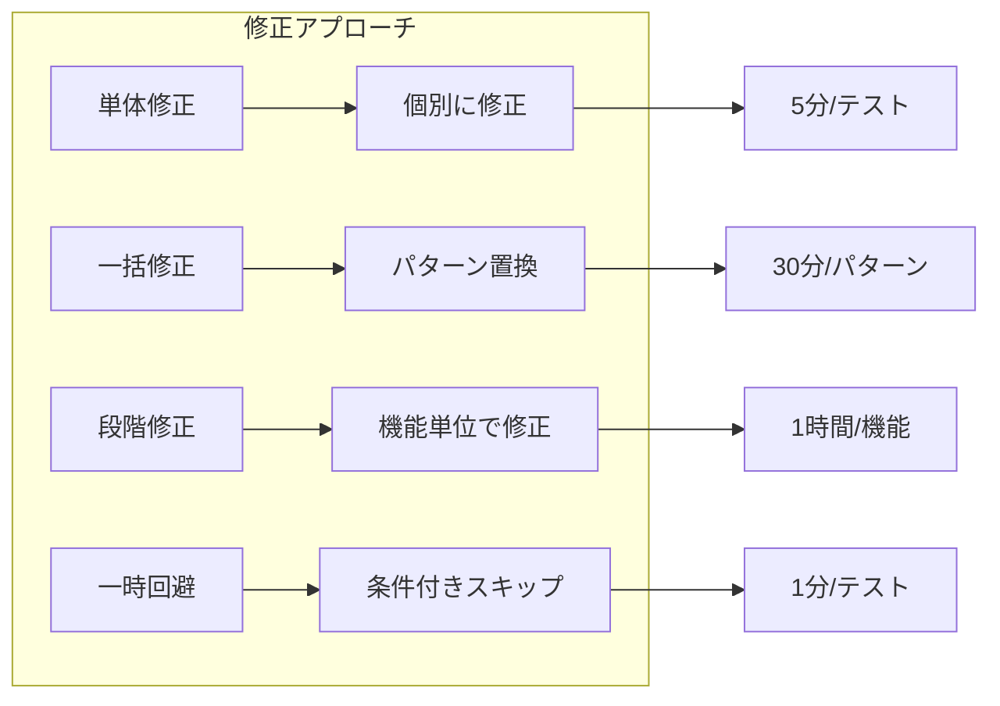
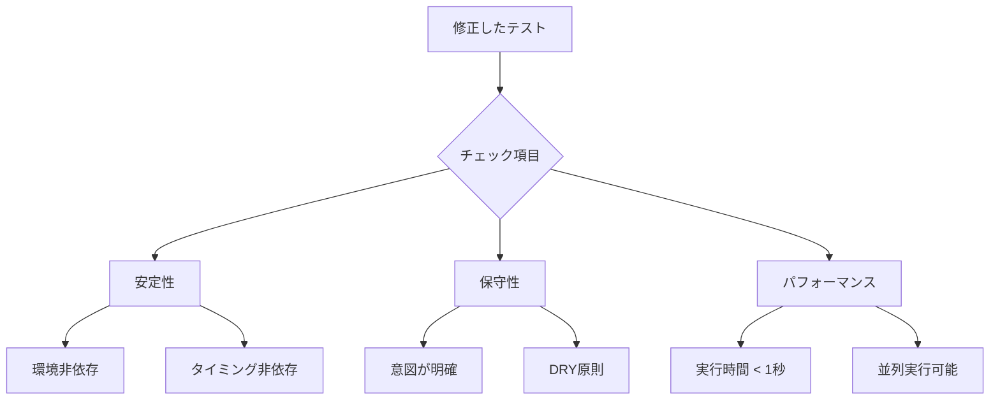
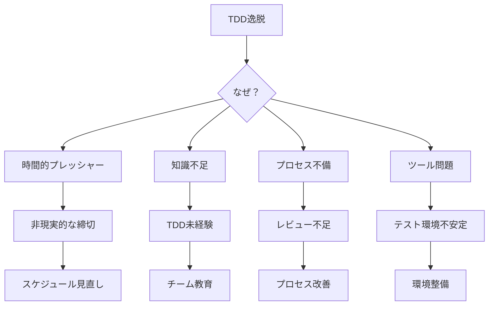
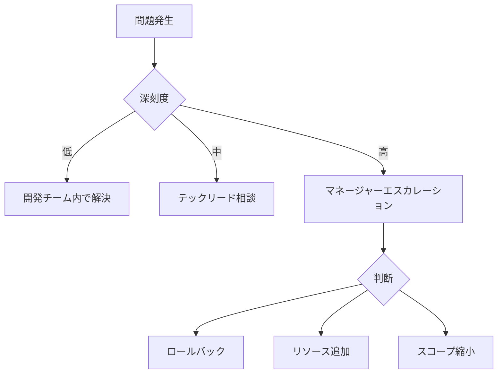

# テスト修正ワークフロー

## 概要
TDDサイクルから逸脱して複数のテストが失敗している状況での体系的な修正手順。

## 適用基準

### このワークフローを使う場合
- CI/CDがブロックされている
- 他の開発者の作業に影響が出ている
- 複数の機能領域でテストが失敗している
- 単純な修正では解決できない

### 使わない場合
- 失敗が特定の機能に限定されている
- 原因が明確で即座に修正可能
- 通常のTDDサイクルで対応可能

## 緊急対応フロー



## Phase 0: 緊急判断（5分以内）

### 0.1 影響度の確認

```bash
# CIの状態確認
git log --oneline -1 # 最新コミット確認
npm run test 2>&1 | grep -c "FAIL" # 失敗数カウント

# 影響範囲の特定
npm run test 2>&1 | grep "FAIL" | cut -d' ' -f2 | sort | uniq
```

### 0.2 ロールバック判断



### 0.3 タイムボックスの設定

| 状況 | 制限時間 | アクション |
|------|----------|------------|
| 本番デプロイ前 | 30分 | 修正 or ロールバック |
| 開発ブロック | 2時間 | 段階的修正 |
| 低影響 | 1日 | 計画的修正 |

## Phase 1: 初期分析（15分）

### 1.1 失敗パターンの特定

```bash
# テスト失敗の詳細取得
npm run test -- --reporter=json > test-results.json 2>&1

# 失敗の種類別集計
npm run test 2>&1 | grep -E "Error:|Expected|Received" | sort | uniq -c | sort -nr

# 最近の変更確認
git log --since="2 hours ago" --name-only --oneline
```

### 1.2 原因の分類と対応



## Phase 2: トリアージ（30分）

### 2.1 優先順位マトリクス



### 2.2 並行作業の調整

```typescript
// テストを一時的に分離
describe.skip('修正中: #issue-123', () => {
  // 修正中のテスト
});

// 代替テストの提供
describe('暫定テスト', () => {
  test('最小限の動作確認', () => {
    // クリティカルな機能のみ確認
  });
});
```

## Phase 3: 段階的修正

### 3.1 修正戦略



### 3.2 共通パターンの修正

#### セレクタの改善
```typescript
// 🔴 Bad: 実装詳細に依存
const element = container.querySelector('.btn-primary');

// 🟢 Good: アクセシブルなセレクタ
const element = screen.getByRole('button', { name: /submit/i });
```

#### 非同期処理の改善
```typescript
// 🔴 Bad: 固定時間待機
await new Promise(r => setTimeout(r, 1000));

// 🟢 Good: 条件待機
await waitFor(() => expect(screen.getByText('完了')).toBeInTheDocument());
```

#### モックの改善
```typescript
// 🔴 Bad: グローバルモック
jest.mock('./api');

// 🟢 Good: テスト単位のモック
const mockApi = jest.fn();
jest.mock('./api', () => ({ api: mockApi }));

beforeEach(() => {
  mockApi.mockClear();
});
```

## Phase 4: 検証と安定化

### 4.1 段階的検証

```bash
# Level 1: クリティカルパスの確認
npm run test -- --testPathPattern="critical|core"

# Level 2: 機能単位の確認
npm run test -- --testPathPattern="features"

# Level 3: 全体確認
npm run test

# Level 4: 関連チェック
npm run lint && npm run typecheck && npm run build
```

### 4.2 修正品質の確認



## Phase 5: 根本原因分析

### 5.1 なぜTDDから逸脱したか



### 5.2 再発防止策

| 原因 | 短期対策 | 長期対策 |
|------|----------|----------|
| 時間不足 | ペアプロ/モブプロ | スプリント計画改善 |
| スキル不足 | メンター制度 | TDD研修実施 |
| プロセス | PR必須化 | CI/CD強化 |
| 環境問題 | Docker化 | テスト基盤刷新 |

## Phase 6: チーム連携

### 6.1 コミュニケーション

```markdown
## 🚨 テスト修正状況

### 現状
- 失敗数: 45 → 12件（残り12件）
- 影響: CI/CDパイプライン停止中
- 推定修正時間: 2時間

### 対応中
- @user1: 認証系テスト修正中（P0）
- @user2: UIコンポーネント修正中（P1）

### ブロッカー
- [ ] APIモックの更新が必要（@backend-team）

### 次のステップ
- 14:00 状況確認MTG
- 16:00 修正完了予定
```

### 6.2 エスカレーション基準



## まとめ

### Do's ✅
- タイムボックスを設定する
- ロールバックを恐れない
- 小さな成功を積み重ねる
- チームとコミュニケーションを取る
- 根本原因を分析する

### Don'ts ❌
- すべてを一度に修正しようとする
- 原因分析をスキップする
- 一人で抱え込む
- テストの品質を犠牲にする
- 同じ失敗を繰り返す

## コマンドリファレンス

```bash
# 緊急対応
git revert HEAD                # 直前のコミットを取り消し
git reset --hard HEAD~1        # 直前のコミットを削除（注意）

# 分析
npm run test -- --listTests    # テストファイル一覧
npm run test -- --findRelatedTests [file] # 関連テスト実行

# 修正
npm run test -- --watch        # 変更監視モード
npm run test -- --bail         # 最初のエラーで停止

# 検証
npm run test -- --changedSince=main # mainとの差分のみテスト
npm run test -- --coverage     # カバレッジ確認
```

## 関連ドキュメント

- `/docs/rules/tdd-guideline.md` - TDDの基本原則
- `/docs/rules/frontend/011_tdd_with_storybook.md` - StorybookでのTDD
- `/tasks/implementation.md` - 通常の実装フロー
- `.github/ISSUE_TEMPLATE/test-failure.md` - テスト失敗時のイシューテンプレート